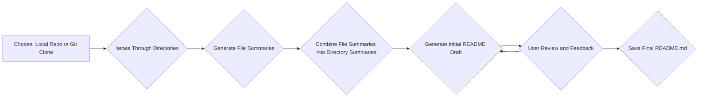

# README-Maker

Say goodbye to writer's block when creating README files! This command-line tool harnesses the power of Google Gemini to automatically generate comprehensive and informative README.md files for your coding projects.

## Table of Contents

- [Installation](#installation)
- [Configuration](#configuration)
- [Usage](#usage)
- [How it Works](#how-it-works)
- [Dependencies](#dependencies)
- [License](#license)

## Installation

1. **Clone the Repository:**
   ```bash
   git clone https://github.com/your-username/README-Maker.git
   cd README-Maker
   ```

2. **Install Dependencies:**
   ```bash
   pip install -r requirements.txt
   ```

3. **Set your Google API Key:**
   - Create a `.env` file in the root directory of the project.
   - Add your Google API key to the `.env` file:

     ```
     GOOGLE_API_KEY="YOUR_API_KEY_HERE" 
     ```

## Configuration

Customize the analysis by excluding specific files and directories. Edit these CSV files in the project's root directory:

- **ignored_dir.csv:**  List directories to ignore (e.g., "tests", "docs", "__pycache__").
- **ignored_exts.csv:**  List file extensions to ignore (e.g., ".txt", ".log", ".csv"). 
- **ignored_files.csv:**  List specific file names to ignore (without extensions, e.g., "LICENSE", "mnvw").

## Usage

1. **Navigate to the Project Directory:**
   ```bash
   cd README-Maker  
   ```

2. **Using the CLI:**
   Execute the following commands from your terminal within the project directory:

   ```bash
   python main.py --local <local_directory_path>  
   python main.py --git <repository_url> --root <clone_at_local_directory>
   python main.py -h 
   ```

   - **`--local <local_directory_path>`:** Analyze a local project directory (replace `<local_directory_path>` with the actual path).
   - **`--git <repository_url> --root <clone_directory>`:** Clone a Git repository and analyze it.
     - Use `--root` to specify the local directory where the repository will be cloned.
   - **`-h`:**  Display help information.

3. **Providing a Project Description:**
   - The tool will prompt you to enter a brief description of your project, which aids in generating a contextually relevant README.

4. **Review and Feedback:**
   -  The generated README.md will be displayed in your terminal. Review the content and request revisions if needed. 

5. **README Generation:**
   - The final README.md file will be created in the root directory of the project, overwriting any existing README.md file.

## How it Works



1. **Source Selection:** Choose to analyze either a local directory or a Git repository. The tool clones Git repositories to your machine before analysis.
2. **Directory Traversal:** README-Maker recursively explores your project directory structure, identifying code files while respecting your configured exclusions. 
3. **File Summary Generation:** Each code file is analyzed using Google's Gemini 1.5 Pro model, which generates a concise summary of its contents and purpose.
4. **Directory Summary Aggregation:**  File summaries within a directory are combined into a comprehensive directory-level summary, providing a higher-level overview of the code organization.
5. **README Draft Generation:**  The tool leverages the directory summaries and your provided project description to generate an initial draft of your README.md file.
6. **User Feedback and Iteration:** You have the opportunity to review the generated README and provide feedback. The model uses your input to refine the README until you're satisfied.
7. **Final README Generation:**  Once you're happy with the content, the final README.md file is saved in your project directory, ready to enhance your project's documentation.

## Dependencies

**External Libraries:**
- `argparse`
- `os`
- `time`
- `pandas`
- `tqdm`
- `sys`
- `google.generativeai`
- `dotenv`
- `threading`

**Internal Modules:**
- `spinner`
- `redme_model` 
- `code_reader_model`
- `dir_sticher_model`
- `utils`

## License

This project is licensed under the MIT License - see the [LICENSE](LICENSE) file for details. 
